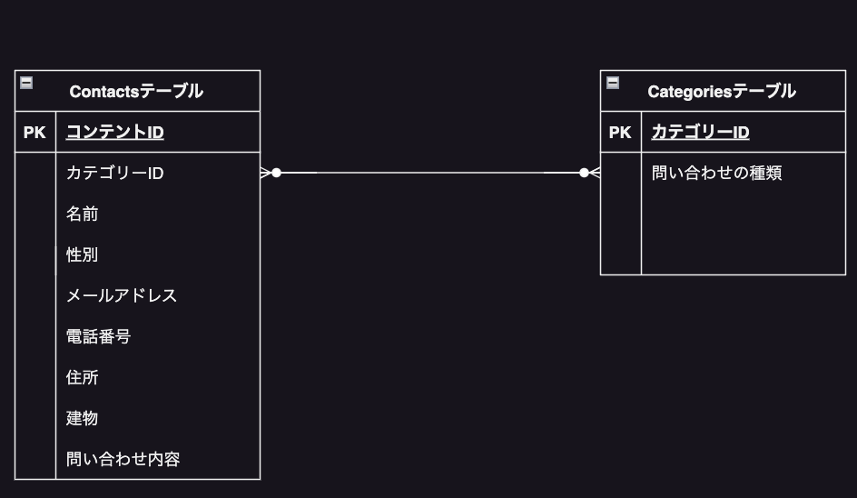

# お問い合わせフォーム 

## 環境構築 

Dokerビルド

　1.git clone git@github.com:coachtech-material/laravel-docker-template.git
　2.docker-compose up -d -build
　＊MySQLは、OSの起動によって起動しない場合があるのでそれぞれのPCに合わせてdocker-compose.ymlファイルを編集して下さい。

Laravel環境構築

　1.docker-compose exec php bash
　2.composer install
　3..env.exampleファイルから.envを作成し、環境構築を変更
　4.php artisan key:generate
　5.php artisan migrate
　6.php artisan db:seed

##使用技術

　・PHP 7.4.9
　・laravel Framework 8.83.27
　・mysql  Ver 15.1
　・nginx:1.21.1

##ER図

#URL

　・開発環境：http://localhost/
　・phpMyAdmin：http://localhost:8080/

